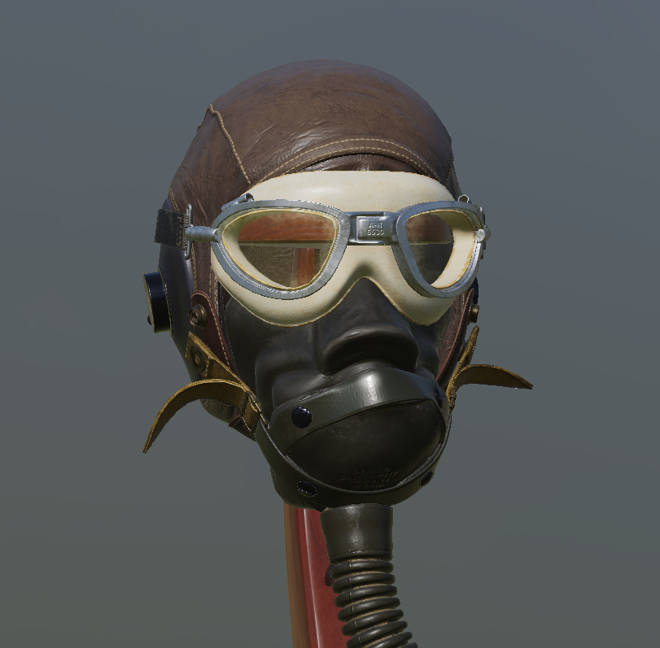

# MDXR

MDXR is my D3D12 deferred rendering engine written in C++. It features PBR
shading, HDR environment lighting, and ray traced shadows.

# Showcase

## PBR Shading

MDXR uses PBR shading. PBR textures are loaded directly from GLTF models,
including base color, normal, and combined occlusion/metal/roughness textures.

## HDR Environment Lighting

MDXR is able to load HDR cubemaps and render the scene with specular and diffuse
IBL.

https://user-images.githubusercontent.com/1817000/206486588-dcd9499e-8f18-4fc1-9b07-2fead0982b3e.mp4

## Deferred Rendering

MDXR uses a deferred rendering architecture. The scene is rendered to base
color, normal, occlusion/metal/roughness, and depth gbuffers and lighting is
computed in a seperate pass.

## Ray Traced Shadows

MDXR uses inline raytracing queries from DXR 1.1 to power its shadows. It can
render dynamic shadows for point and directional lights.

https://user-images.githubusercontent.com/1817000/206486720-5853b37a-644d-4d7d-9306-6f04ab410504.mp4

https://user-images.githubusercontent.com/1817000/206486762-008e1b41-4dc5-4c7b-a5df-54a485f6982d.mp4

## Bloom

MDXR achieves bloom by filtering pixels above a luminosity threshold and
applying a blur to those pixels. This will make pixels too bright to be
accurately represented by the monitor glow.

